# 财务分析平台修正清单 - 整理版

## 📋 修正项目总览
共33个修正项目，涉及数据分析、权限管理、表单修复、计算公式等多个方面。

---

## 🔧 **紧急修复项目**

### 项目六：资产负债表卡死问题 ⚠️
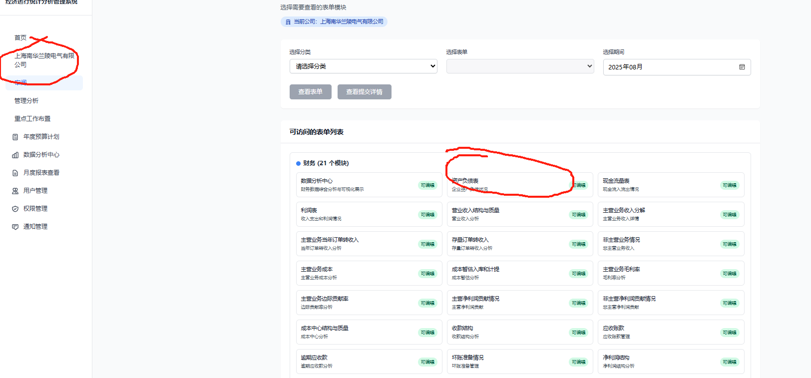

**问题描述：**
- 电气公司的资产负债表一输入就卡死，需要修复
- 期初余额应为上一月期末金额，一月表期初金额为填写项
- 电气和实业公司的资产负债表都存在问题

**修复要求：**
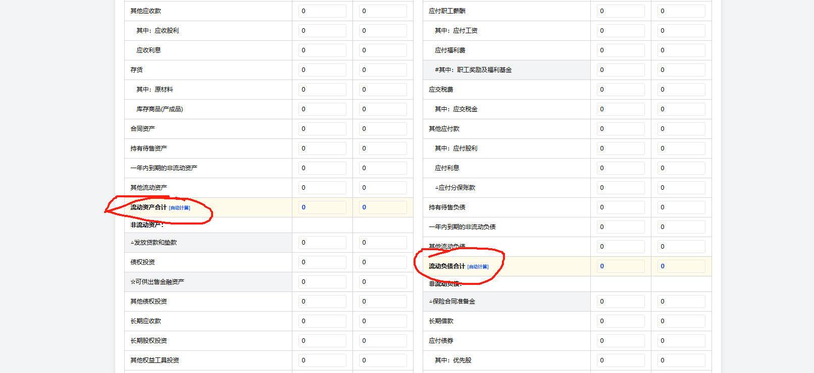
- 将流动资产合计与流动负债合计对齐，可以在流动资产合计上加入空行

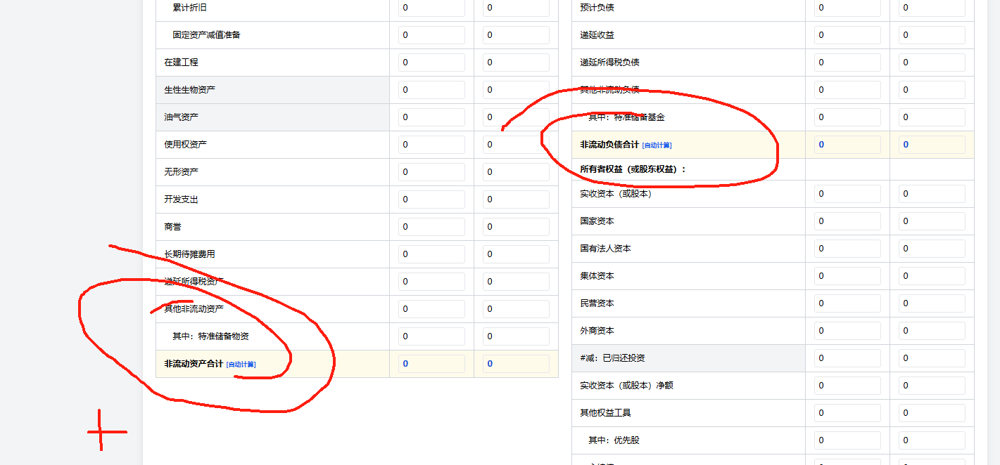
- 非流动资产和非流动负债合计对齐
- 非流动负债下面缺少一行计算项 **负债合计**
- 非流动资产下缺少一行**资产合计，和负债和所有者权益总计对齐**

**📋 实施计划：**
1. **代码定位**：
   - 主要文件：`financial-analytics-platform/src/views/example/index.vue` (电气公司)
   - 实业公司：`financial-analytics-platform/src/views/example/ShanghaiNanhuaLanlingBalanceSheet.vue`
   - 拓源公司：`financial-analytics-platform/src/views/companies/financial-reports/ChangzhouTuoyuanElectricBalanceSheet.vue`

2. **问题分析**：
   - 卡死原因：可能是计算函数`recalculateAll()`的无限循环问题
   - 期初余额：已有`autoSetBeginBalanceFromPreviousMonth`函数，需要优化

3. **修复步骤**：
   ```javascript
   // 1. 修复计算循环问题
   let isCalculating = false
   watch(data, () => {
     if (!isCalculating) {
       isCalculating = true
       recalculateAll()
       nextTick(() => { isCalculating = false })
     }
   }, { deep: true })

   // 2. 添加资产合计和负债合计行
   // 3. 调整表格对齐样式
   ```

4. **测试验证**：
   - 测试输入数据不卡死
   - 验证期初余额自动设置
   - 检查表格对齐效果

**⏱️ 预计时间**：2-3小时
**🎯 优先级**：最高

---

## 📊 **数据分析和图表修正**

### 项目一：电气公司数值错误
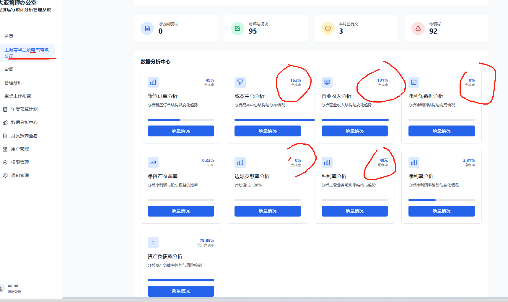
- 电气公司该部分数值不对，需要修正

**📋 实施计划：**
1. **代码定位**：
   - 分析页面：`financial-analytics-platform/src/views/analytics/index.vue`
   - 数据API：`financial-backend/routes/analytics.js`
   - 资产负债率计算：`/asset-liability-ratio/:year`

2. **问题排查**：
   ```javascript
   // 检查数据获取逻辑
   const response = await fetch(`http://127.0.0.1:3000/analytics/asset-liability-ratio/${year}?company=main`)
   // 验证计算公式：资产负债率 = 总负债 / 总资产 × 100%
   ```

3. **修复步骤**：
   - 检查电气公司数据表名映射
   - 验证计算公式正确性
   - 修复数据显示问题

**⏱️ 预计时间**：1-2小时

### 项目二：营业收入曲线图优化
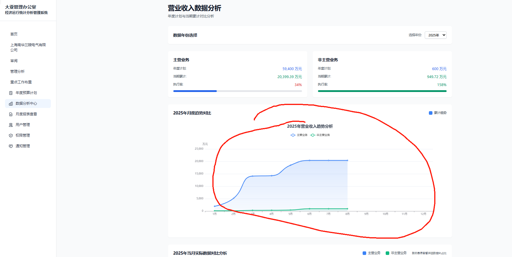
**修改要求：**
- 在营业收入曲线图上再加上一条数据来自财务报表·（利润表）的曲线，作为对比（不同颜色）
- 可以只做主营业务的财务报表曲线
- 三个公司的对分析都需要更改
- 该图表右上角要说明各颜色曲线涵义

**📋 实施计划：**
1. **代码定位**：
   - 图表组件：`financial-analytics-platform/src/views/companies/ChangzhouTuoyuanElectric.vue`
   - 收入图表：`initRevenueChart()` 函数
   - 利润表API：`financial-backend/routes/changzhouTuoyuanIncomeStatement.js`

2. **实现步骤**：
   ```javascript
   // 1. 获取利润表数据
   const incomeStatementData = await fetch('/changzhou-tuoyuan-income-statement/period')

   // 2. 修改图表配置
   const chartOption = {
     series: [
       { name: '营业收入', data: revenueData, color: '#3b82f6' },
       { name: '财务报表收入', data: incomeData, color: '#ef4444' }
     ],
     legend: { show: true, position: 'top-right' }
   }
   ```

3. **三个公司统一修改**：
   - 电气公司、实业公司、拓源公司
   - 统一图例样式和颜色方案

**⏱️ 预计时间**：3-4小时

### 项目三：电气公司数据分析未读取
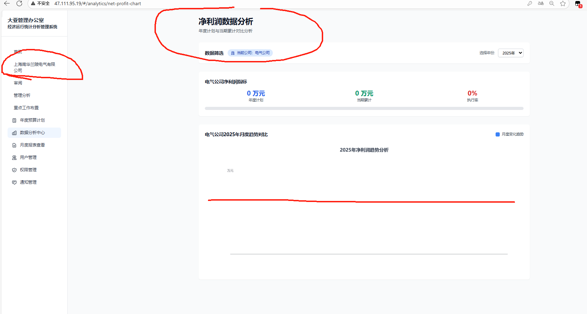
- 电气公司该数据分析未读取到数据
- **修复后和第三项一致，再加上一条数据来源为利润表的曲线，以作对比**

**📋 实施计划：**
1. **问题诊断**：
   - 检查API端点是否正常
   - 验证数据库连接和查询
   - 确认公司参数映射

2. **修复方案**：
   ```javascript
   // 检查公司映射
   const tableMap = {
     'main': 'balance_sheet',
     'nanhua': 'nanhua_balance_sheet',
     'tuoyuan': 'tuoyuan_balance_sheet'
   }
   ```

**⏱️ 预计时间**：1-2小时

---

## 🔐 **权限管理修正**

### 项目四：权限板块重组

- 为这四项添加和数据分析中心相同的权限
- 加上数据分析中心一共五项**权限**单独放在一个板块里
- 不要放在财务模块里

**📋 实施计划：**
1. **代码定位**：
   - 权限管理：`financial-backend/routes/permissions.js`
   - 模块配置：`form_modules` 数据表
   - 角色权限：`role_permissions` 数据表

2. **数据库操作**：
   ```sql
   -- 1. 创建新的权限分类
   UPDATE form_modules SET module_category = '数据分析'
   WHERE module_key IN ('analytics_center', 'module1', 'module2', 'module3', 'module4');

   -- 2. 调整显示顺序
   UPDATE form_modules SET display_order = 1 WHERE module_key = 'analytics_center';
   ```

3. **前端路由调整**：
   - 修改导航菜单分类
   - 更新权限检查逻辑

**⏱️ 预计时间**：2-3小时

### 项目五：角色权限重建
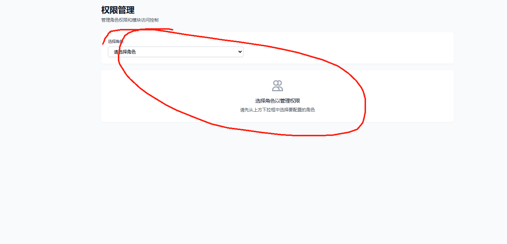
- 把这个角色按照之前发的权限调整重新分化建立一下

**📋 实施计划：**
1. **权限分析**：
   - 当前角色：`financial-backend/routes/userManagement.js`
   - 权限配置：`financial-backend/scripts/add_analytics_center_permission.js`

2. **重建步骤**：
   ```javascript
   // 1. 清理现有权限
   await connection.execute('DELETE FROM role_permissions WHERE role_id = ?', [roleId])

   // 2. 重新分配权限
   const newPermissions = {
     'analytics_center': 'read',
     'balance_sheet': 'write',
     'income_statement': 'write'
     // ... 其他权限
   }
   ```

3. **验证测试**：
   - 测试各角色权限正确性
   - 确认页面访问控制

**⏱️ 预计时间**：2-3小时

---

## 💰 **财务报表计算公式修正**

### 利润表计算错误修正
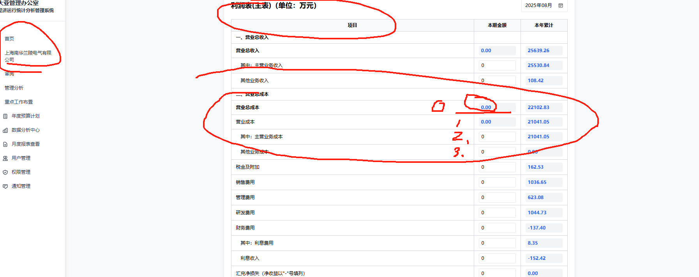
- 电气公司中营业总成本（第0项）存在计算公式错误
- 现在：0=1+2+3，**正确公式为0=1或者0=2+3**
- **其他公司的利润表的计算项也应于电气公司该表一致**
- **现金流量表中小计，净额都应是计算值**

**📋 实施计划：**
1. **代码定位**：
   - 电气公司利润表：`financial-analytics-platform/src/views/companies/financial-reports/ChangzhouTuoyuanElectricIncomeStatement.vue`
   - 拓源利润表：`financial-analytics-platform/src/views/example/ChangzhouTuoyuanIncomeStatement.vue`
   - 后端计算：`financial-backend/routes/changzhouTuoyuanIncomeStatement.js`

2. **计算公式修正**：
   ```javascript
   // 修正营业总成本计算
   const calculateOperatingCosts = () => {
     // 错误公式：营业总成本 = 营业成本 + 税金及附加 + 销售费用
     // 正确公式：营业总成本 = 营业成本 或者 营业总成本 = 税金及附加 + 销售费用

     // 方案1：营业总成本 = 营业成本
     data.operatingTotalCost = data.operatingCost

     // 方案2：营业总成本 = 税金及附加 + 销售费用
     // data.operatingTotalCost = data.taxesAndSurcharges + data.sellingExpenses
   }
   ```

3. **统一三个公司**：
   - 电气公司、实业公司、拓源公司
   - 确保计算逻辑一致性
   - 添加自动计算功能

4. **现金流量表修正**：
   ```javascript
   // 小计和净额改为计算值
   const calculateCashFlowSubtotals = () => {
     // 经营活动现金流量小计
     data.operatingSubtotal = data.operatingInflows - data.operatingOutflows

     // 投资活动现金流量净额
     data.investingNetAmount = data.investingInflows - data.investingOutflows
   }
   ```

**⏱️ 预计时间**：4-5小时
**🎯 优先级**：高

---

## 📝 **表单结构优化**

### 项目七：目标达成情况
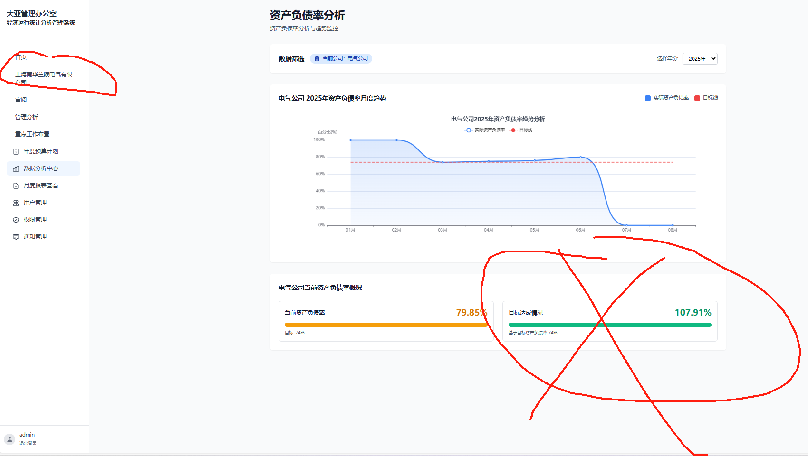
- 把该表中的目标达成情况去v掉

### 项目八：坏账准备表单
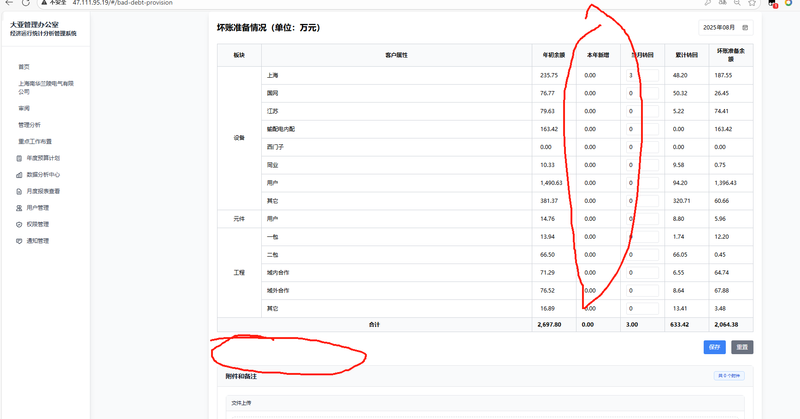
- 将坏账本年新增改为输入值
- 在表单下加一行备注：坏账转回应说明去向
- 另外两个公司相同（实业公司、拓源公司）

**📋 实施计划：**
1. **代码定位**：
   - 坏账准备表单：`financial-analytics-platform/src/views/newTable/BadDebtProvision.vue`
   - 后端API：`financial-backend/routes/badDebtProvision.js`

2. **修改步骤**：
   ```vue
   <!-- 将只读字段改为输入字段 -->
   <td class="border border-gray-300 px-4 py-2">
     <input v-model="item.currentYearIncrease" type="number"
            class="w-full px-2 py-1 border rounded" step="0.01" />
   </td>

   <!-- 添加备注行 -->
   <div class="mt-4 p-4 bg-gray-50 rounded">
     <p class="text-sm text-gray-600">备注：坏账转回应说明去向</p>
   </div>
   ```

3. **三个公司统一修改**：
   - 电气公司、实业公司、拓源公司
   - 确保表单结构一致

**⏱️ 预计时间**：2-3小时

### 项目九：逾期应收款表单
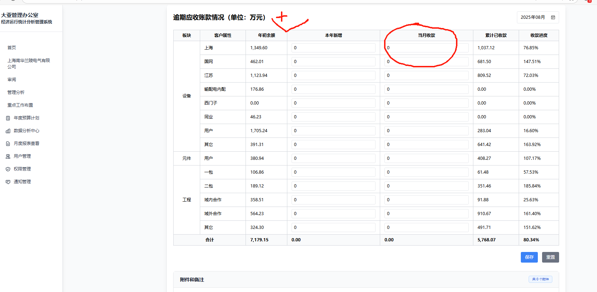
- 逾期应收款当月收款改为逾期应收款当月收款
- **在本年新增列前加一列为本月新增，同时将本年新增改为计算项**
- 另外两个公司逾期应收表单修改处一致（实业公司、拓源公司）

### 项目十：分类贡献占比
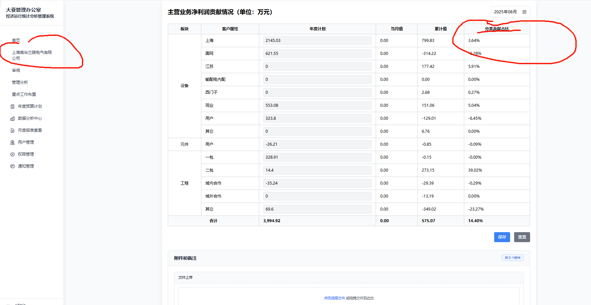
- 将分类贡献占比改为执行进度

---

## 🎨 **界面和格式统一**

### 项目十一：表单尺寸调整
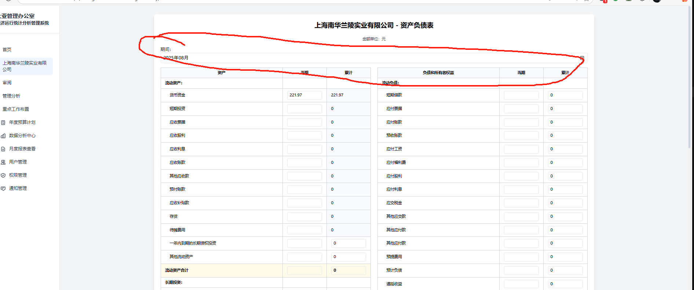
- 这个缩小到右边，和其他表单一致（三个公司都需要修改）
- 有些累计值还是可以输入的需要修正
- 合计值当期和累计都是要计算的
- 加空格是资产总计和负债和所有者权益合计对齐

### 项目十二：现金流量表格式
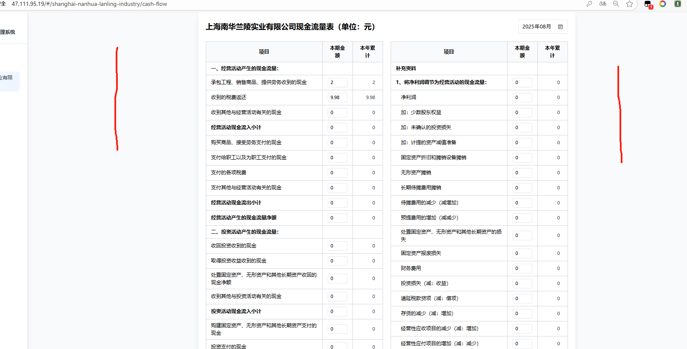
- 这个表调宽一点，单位从元改成万元
- **同时小计，净额的本期金额也要改为计算值**

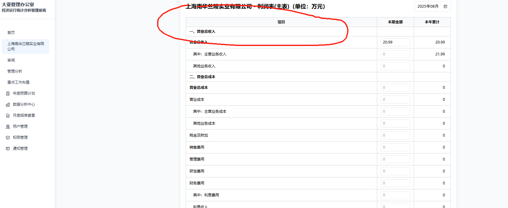
- 该表同理，一些项改为计算值，具体项和电气公司利润表单一致

---

## 🧮 **计算公式完善**

### 项目十三：应收账款计算

- 该项的计算公式要再减去一项坏账准备的**本月新增（注意不是累计值）**
- 在表头后面添加**备注：当期应收余额以减去坏账准备**
- 其余两个公司的应收账款也做如此修改（实业公司、拓源公司）

---

## 🏢 **客户属性标准化**

### 项目十四：实业公司客户属性统一
实业公司所有表单的客户属性均改为：
- **一包项目**
- **二包项目**
- **域内合作项目**
- **域外合作项目**
- **新能源项目**
- **苏州项目**
- **自接项目**（从自建项目改为自接项目）
- **其他**

以上客户属性均为工程板块

**注意：有一些表单的口径无需更改，什么部门口径之类的，就是原表单中没有一包项目，二包项目的就无需更改了。**

**📋 实施计划：**
1. **代码定位**：
   - 实业公司表单：`financial-analytics-platform/src/views/nanhua/` 目录下所有表单
   - 客户属性配置：各表单的 `customerTypes` 数组

2. **批量修改步骤**：
   ```javascript
   // 统一的客户属性配置
   const engineeringCustomerTypes = [
     '一包项目', '二包项目', '域内合作项目', '域外合作项目',
     '新能源项目', '苏州项目', '自接项目', '其他'
   ]

   // 应用到所有工程板块表单
   const updateCustomerTypes = (formData) => {
     if (formData.engineering) {
       formData.engineering.forEach(item => {
         item.customerAttribute = engineeringCustomerTypes[0] // 默认值
       })
     }
   }
   ```

3. **需要修改的表单**：
   - 主营业务收入分解
   - 主营业务成本
   - 业务利润率
   - 新订单情况
   - 中标履约情况

4. **验证测试**：
   - 确认下拉选项正确显示
   - 验证数据保存和加载
   - 检查报表统计正确性

**⏱️ 预计时间**：3-4小时

---

## 🔄 **表单结构统一**

### 项目十五：实业公司坏账准备
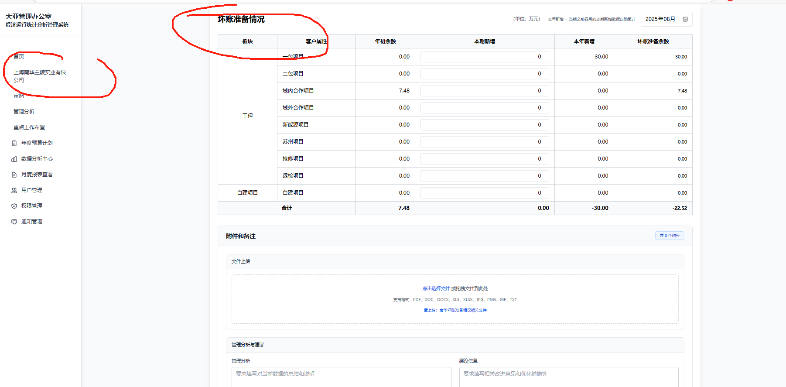
- 实业公司坏账准备表单结构也改为和电气公司一致

### 项目十六：删除多余列
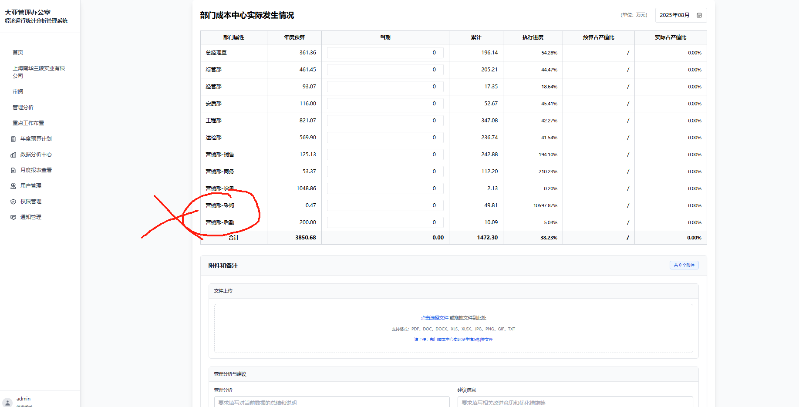
- 这两列营销部-采购，营销部-后勤要删掉的，之前的说已经完成，但现在依旧存在

### 项目十七：表单结构调整
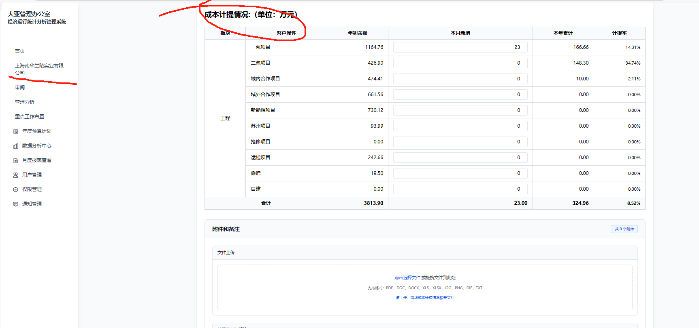
- 表单结构要做出改变，和电气公司表单一致

### 项目十八：删除错误表单
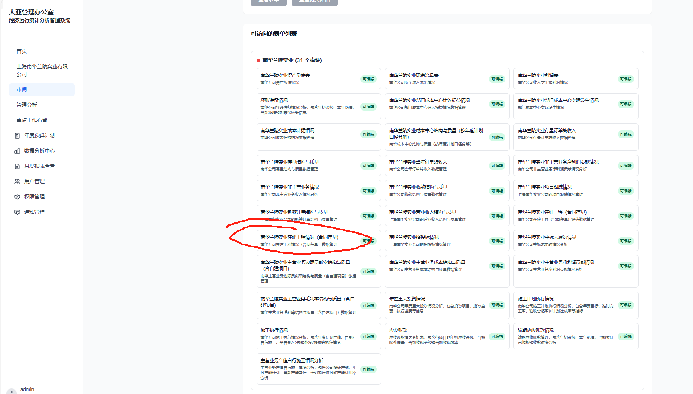
- **这个表单还是没有删掉（注意不要删错）**

---

## 📊 **中标履约相关**

### 项目十九：中标履约表单
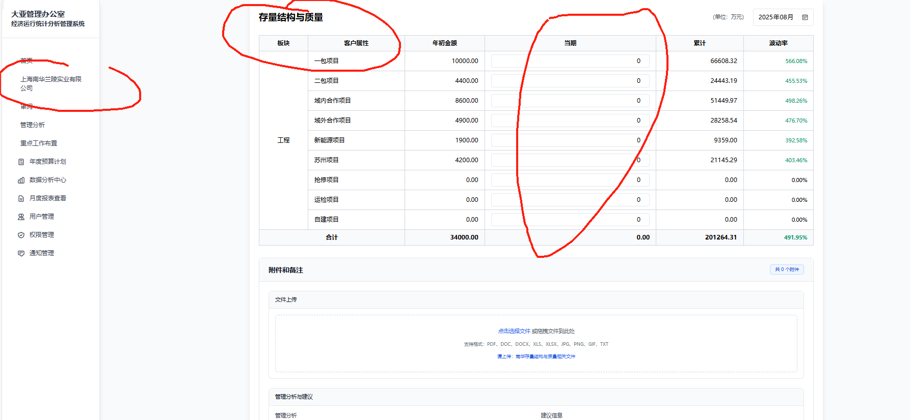
- **该表单结构要改为电气公司一致**
- 改完后，当期金额=中标为履约+在建工程（合同存量）

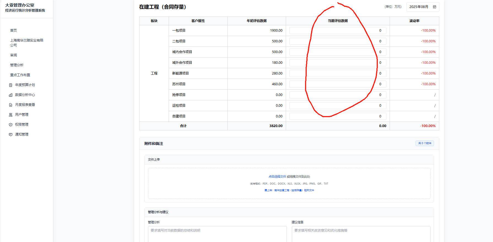
- **中标未履约也要改为电气公司的形式**

### 项目二十：投标中标金额
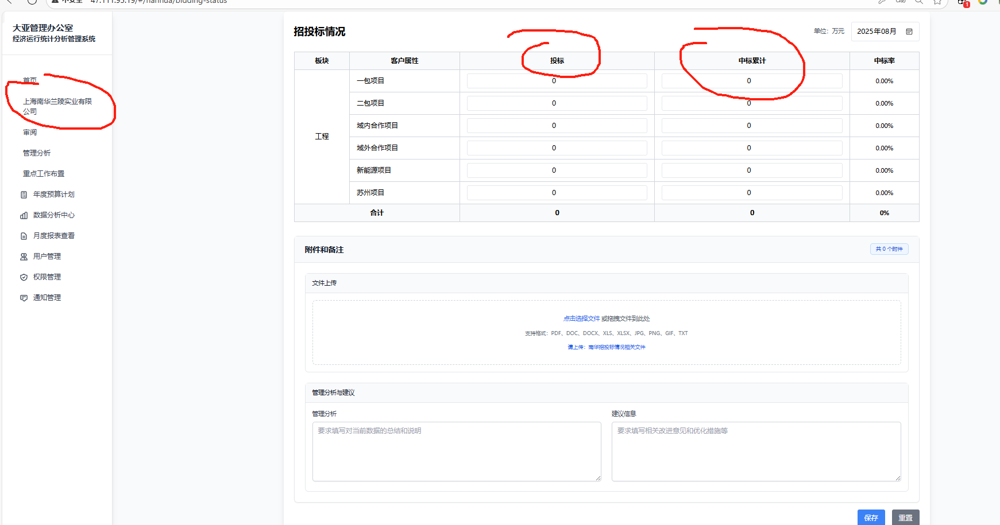
- 将投标改为投标金额，中标累计改为中标金额
- 其他两个公司也要修改（电气公司、拓源公司）

---

## ➕ **新增功能**

### 项目二十一：净利润结构表单
- **实业公司添加一张新的表单，为净利润结构，格式和电气公司一致**

---

## 🏭 **拓源公司专项修正**

### 项目二十二：拓源资产负债表
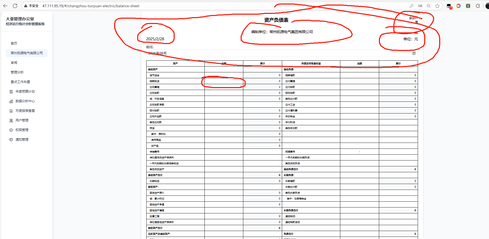
- 把标题改为和其他公司一致，删除多于项
- 把输入框显示出来
- 把当期和累计改为期初金额和期末金额，期初金额为上一个月的期末金额
- 月份选择缩小到右边，不要占据一整列
- **这张表风格都不一样，最好把风格统一（这直接转过来的完全不一致）**
- 把合计值的期末金额也改为计算项
- 单位改为万元

**📋 实施计划：**
1. **代码定位**：
   - 拓源资产负债表：`financial-analytics-platform/src/views/companies/financial-reports/ChangzhouTuoyuanElectricBalanceSheet.vue`
   - 参考模板：`financial-analytics-platform/src/views/example/index.vue`

2. **风格统一修改**：
   ```vue
   <!-- 1. 统一标题样式 -->
   <h1 class="text-2xl font-bold text-center mb-6">资产负债表(主表)（单位：万元）</h1>

   <!-- 2. 期间选择器右对齐 -->
   <div class="mb-4 flex justify-end">
     <div class="w-48">
       <label class="block text-gray-700">期间：</label>
       <input type="month" v-model="period" class="w-full px-2 py-1 border rounded" />
     </div>
   </div>

   <!-- 3. 表头统一 -->
   <th class="border border-gray-300 px-4 py-2 w-40">期末余额</th>
   <th class="border border-gray-300 px-4 py-2 w-40">期初余额</th>
   ```

3. **计算逻辑添加**：
   ```javascript
   // 添加自动计算功能
   const calculateTotals = () => {
     // 流动资产合计
     data.currentAssetsTotal = data.currentAssets.reduce((sum, item) =>
       sum + (item.endBalance || 0), 0)

     // 资产总计
     data.assetsTotal = data.currentAssetsTotal + data.nonCurrentAssetsTotal
   }
   ```

4. **期初余额自动设置**：
   - 复用电气公司的 `autoSetBeginBalanceFromPreviousMonth` 函数
   - 确保1月份可手动输入，其他月份自动设置

**⏱️ 预计时间**：4-5小时
**🎯 优先级**：高（影响用户体验）

### 项目二十三：拓源现金流量表
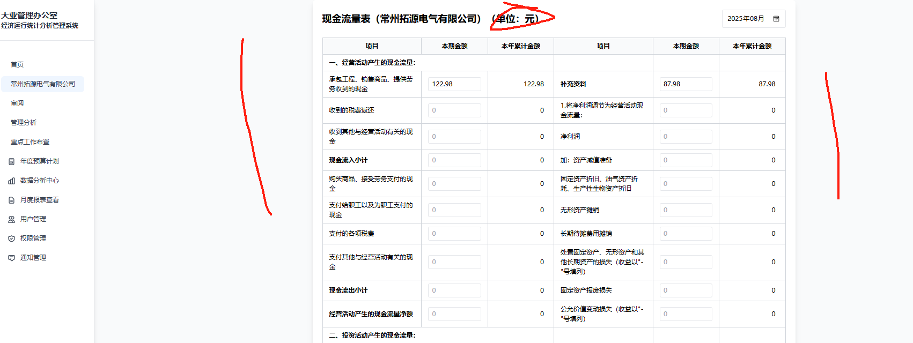
- 宽度拉长一点，单位改成万元
- 小计项和净额项改为计算值

### 项目二十四：拓源利润表
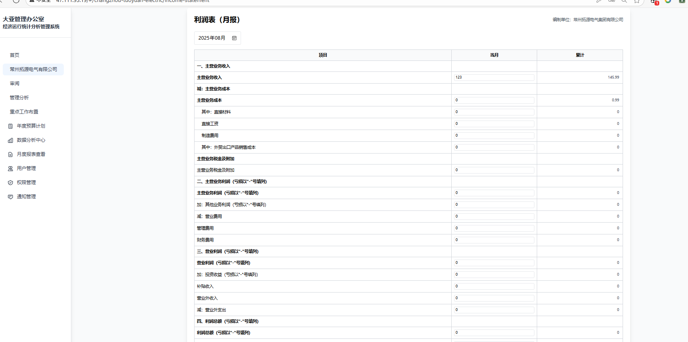
- 加单位万元

### 项目二十五：拓源口径添加
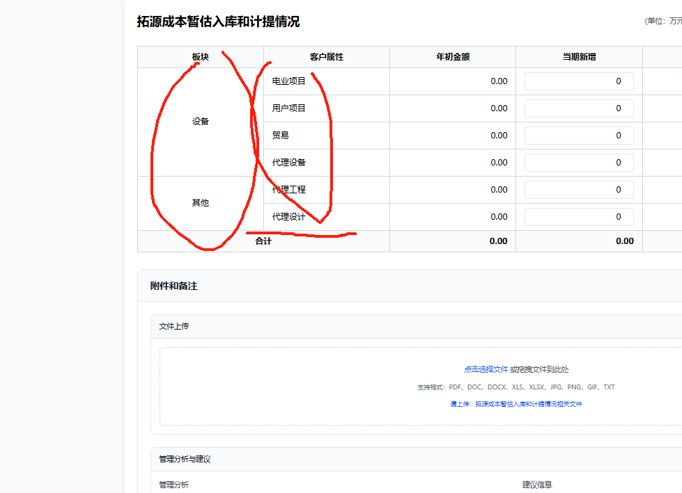
- **在拓源所有表单口径下，代理设计下面加一行为其他**

### 项目二十六：拓源表单格式
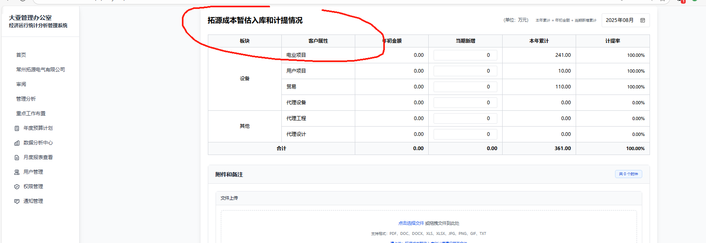
- 该表单格式也要做出调整，和电气公司对应表单一致

### 项目二十七：拓源成本中心结构
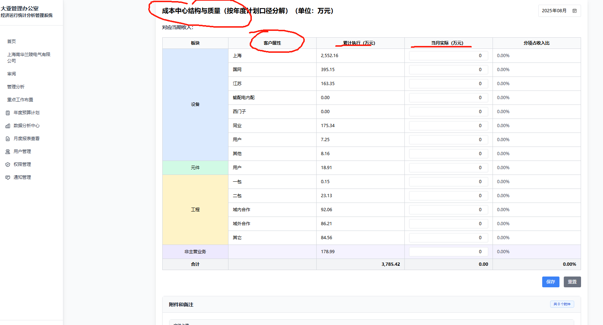
- 拓源公司增加一张表单，与电气公司成本中心结构与质量一致
- 客户属性为第二十五项更改后的口径

### 项目二十八：拓源相关图片
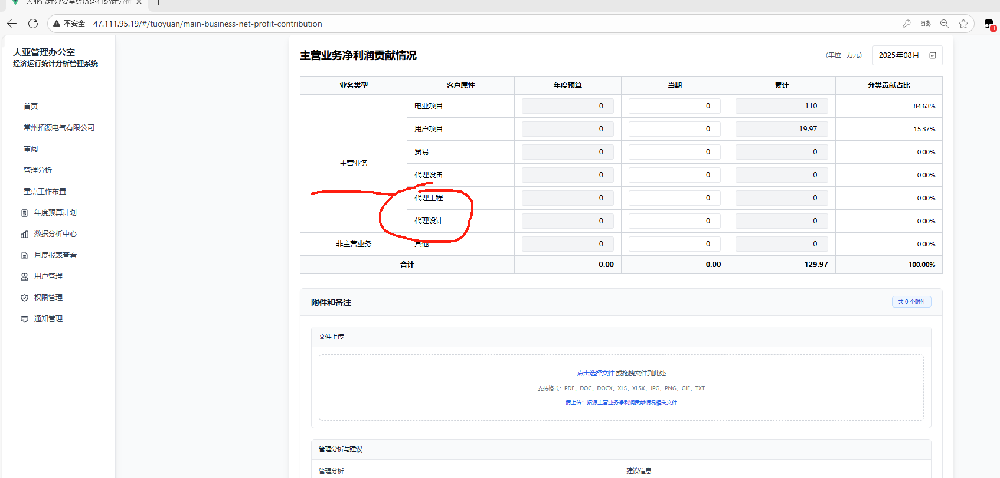
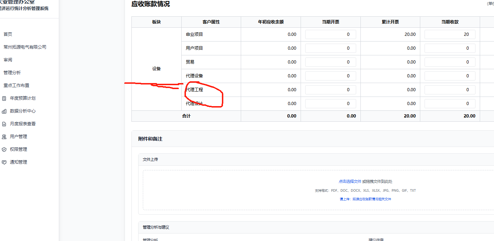

### 项目二十九：拓源净利润计算
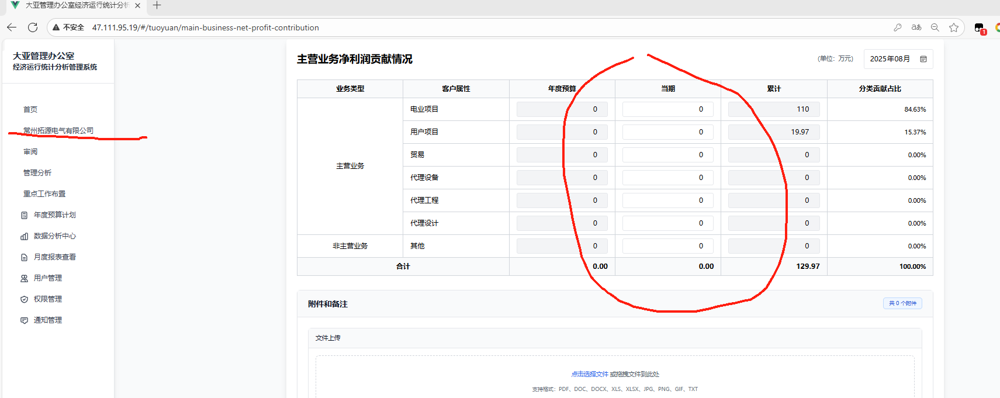
- 净利润也改为计算值，公式与电气公司一致

### 项目三十：拓源多余部分
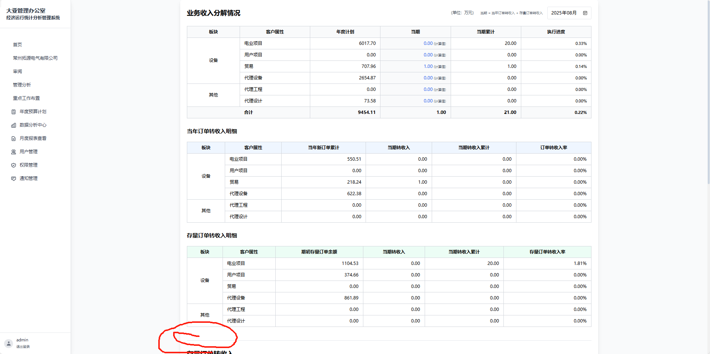
- 多了一部分需要删除

---

## 🔧 **系统功能完善**

### 项目三十一：公司切换功能
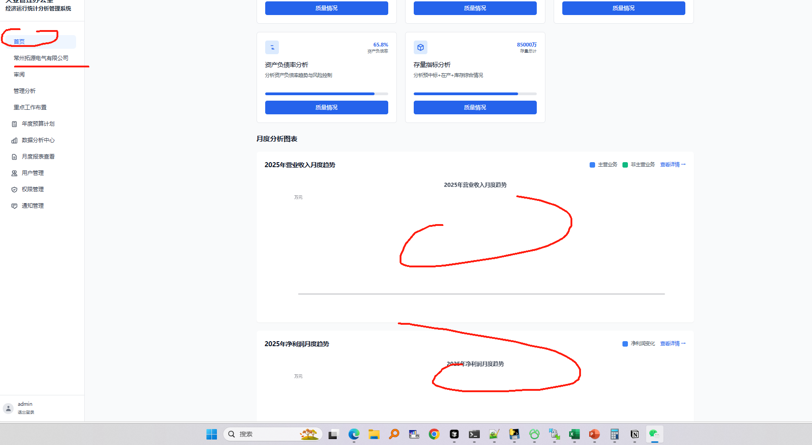
- 没有数值，同时缺失切换到拓源公司和实业公司的选项

### 项目三十二：月度报表生成
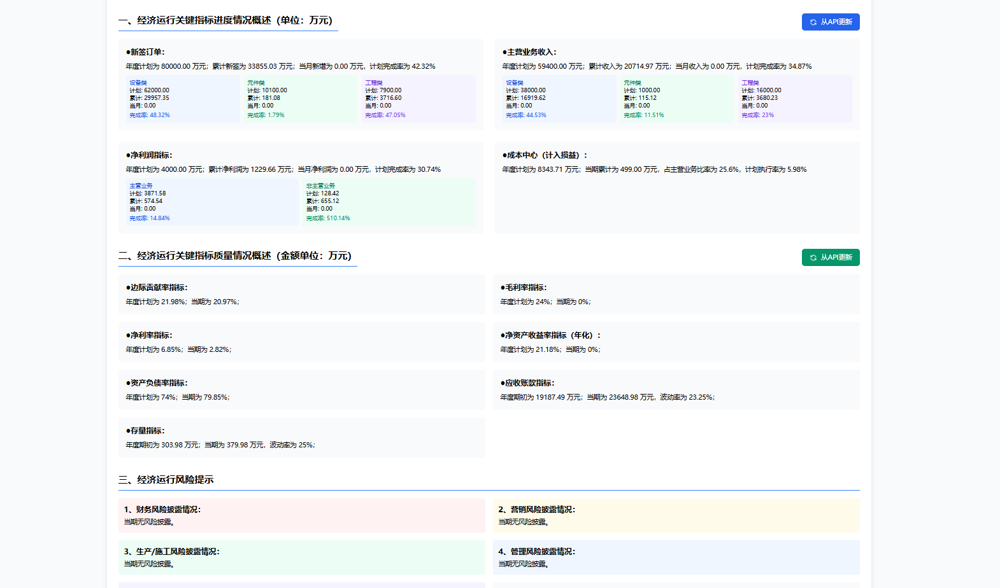
**月度报表 - 三个公司报表输出**
- 生成如图一二三部分，再加上第四部分，加个输入框

**📋 实施计划：**
1. **代码定位**：
   - 报表生成：需要创建新的月度报表组件
   - 参考现有：`financial-analytics-platform/src/views/view/index.vue`

2. **功能实现**：
   ```vue
   <!-- 月度报表生成器 -->
   <template>
     <div class="monthly-report-generator">
       <!-- 公司选择 -->
       <select v-model="selectedCompany">
         <option value="electric">电气公司</option>
         <option value="industry">实业公司</option>
         <option value="tuoyuan">拓源公司</option>
       </select>

       <!-- 期间选择 -->
       <input type="month" v-model="reportPeriod" />

       <!-- 第四部分输入框 -->
       <div class="section-four">
         <h3>第四部分</h3>
         <textarea v-model="customContent" placeholder="请输入自定义内容"></textarea>
       </div>

       <!-- 生成按钮 -->
       <button @click="generateReport">生成月度报表</button>
     </div>
   </template>
   ```

3. **报表内容**：
   - 第一部分：资产负债表摘要
   - 第二部分：利润表摘要
   - 第三部分：现金流量表摘要
   - 第四部分：自定义内容（新增）

4. **导出功能**：
   - PDF导出
   - Excel导出
   - 打印功能

**⏱️ 预计时间**：5-6小时

### 项目三十三：表单顺序调整
- 把两个公司的表单顺序按照电气公司的顺序调整一下

**📋 实施计划：**
1. **代码定位**：
   - 路由配置：`financial-analytics-platform/src/router/routes.ts`
   - 导航菜单：各公司页面的菜单配置

2. **顺序标准化**：
   ```javascript
   // 电气公司标准顺序
   const standardOrder = [
     { name: '资产负债表', order: 1 },
     { name: '利润表', order: 2 },
     { name: '现金流量表', order: 3 },
     { name: '主营业务收入', order: 4 },
     { name: '主营业务成本', order: 5 },
     // ... 其他表单
   ]

   // 应用到实业公司和拓源公司
   const updateMenuOrder = (companyMenus) => {
     return companyMenus.sort((a, b) => {
       const aOrder = standardOrder.find(s => s.name === a.name)?.order || 999
       const bOrder = standardOrder.find(s => s.name === b.name)?.order || 999
       return aOrder - bOrder
     })
   }
   ```

3. **数据库更新**：
   ```sql
   -- 更新表单显示顺序
   UPDATE form_modules SET display_order = ? WHERE module_name = ? AND module_category = ?;
   ```

**⏱️ 预计时间**：2-3小时

---

## 🎯 **总体实施计划**

### 📅 **第一阶段（紧急修复）- 1-2天**
1. **项目六**：资产负债表卡死问题 ⚠️
2. **利润表计算**：营业总成本公式修正
3. **项目十八**：删除错误表单

### 📅 **第二阶段（核心功能）- 3-4天**
1. **数据分析图表**：修正显示错误和添加对比曲线
2. **权限管理**：重组权限板块和角色
3. **表单结构**：统一三个公司的表单格式

### 📅 **第三阶段（功能完善）- 2-3天**
1. **客户属性标准化**：统一各公司客户分类
2. **计算公式完善**：应收账款、坏账准备等
3. **界面优化**：表单尺寸、单位统一

### 📅 **第四阶段（新增功能）- 2-3天**
1. **新增表单**：净利润结构、成本中心结构
2. **月度报表**：完善报表生成功能
3. **系统优化**：表单顺序调整、公司切换

## 🛠️ **技术实施要点**

### **代码修改重点文件**
```
前端核心文件：
├── src/views/example/index.vue (电气公司资产负债表) ⚠️
├── src/views/example/ShanghaiNanhuaLanlingBalanceSheet.vue (实业公司)
├── src/views/companies/financial-reports/ChangzhouTuoyuanElectricBalanceSheet.vue (拓源公司) ⚠️
├── src/views/companies/financial-reports/ChangzhouTuoyuanElectricIncomeStatement.vue (拓源利润表)
├── src/views/analytics/index.vue (数据分析页面)
├── src/views/newTable/BadDebtProvision.vue (坏账准备)
├── src/views/newTable/BusinessProfitMargin.vue (业务利润率)
├── src/router/routes.ts (路由权限配置)
└── src/utils/permission.ts (权限工具)

后端核心文件：
├── routes/permissions.js (权限管理) ⚠️
├── routes/analytics.js (数据分析API)
├── routes/balanceSheet.js (资产负债表API)
├── routes/changzhouTuoyuanIncomeStatement.js (拓源利润表API)
├── routes/badDebtProvision.js (坏账准备API)
└── scripts/add_analytics_center_permission.js (权限脚本)

数据库表：
├── form_modules (模块配置)
├── role_permissions (角色权限)
├── user_roles (用户角色)
└── balance_sheet, income_statement (财务数据表)
```

### **数据库修改**
```sql
-- 权限重组
UPDATE form_modules SET module_category = '数据分析' WHERE ...;

-- 角色权限重建
DELETE FROM role_permissions WHERE role_id = ?;
INSERT INTO role_permissions VALUES ...;
```

## 🎯 **修正优先级建议**

### 🔴 **高优先级（紧急）**
1. 项目六：资产负债表卡死问题
2. 利润表计算公式错误
3. 项目十八：删除错误表单

### 🟡 **中优先级（重要）**
1. 数据分析图表修正（项目1-3）
2. 权限管理重组（项目4-5）
3. 表单结构统一（项目14-21）

### 🟢 **低优先级（优化）**
1. 界面格式统一
2. 新增功能开发
3. 表单顺序调整

## 📊 **进度跟踪建议**

### **每日检查点**
- [ ] 代码修改完成情况
- [ ] 功能测试验证结果
- [ ] 用户反馈收集
- [ ] 问题记录和解决

### **质量保证**
- 所有涉及计算的项目都需要确保公式正确
- 表单格式要保持三个公司之间的一致性
- 删除操作需要特别小心，避免误删
- 新增功能需要与现有功能保持兼容

## 🚀 **快速开始指南**

### **立即开始修复（推荐顺序）**

#### 1️⃣ **紧急修复（今天完成）**
```bash
# 1. 备份数据库
mysqldump -u root -p finance > backup_$(date +%Y%m%d).sql

# 2. 修复资产负债表卡死问题
cd financial-analytics-platform/src/views/example/
# 编辑 index.vue，修复计算循环问题

# 3. 测试验证
npm run dev
# 访问 http://localhost:8080，测试资产负债表输入
```

#### 2️⃣ **权限重组（明天完成）**
```bash
# 1. 执行权限脚本
cd financial-backend/
node scripts/add_analytics_center_permission.js

# 2. 更新模块分类
mysql -u root -p finance
UPDATE form_modules SET module_category = '数据分析' WHERE module_key = 'analytics_center';
```

#### 3️⃣ **计算公式修正（第三天）**
```bash
# 修改利润表计算逻辑
cd financial-analytics-platform/src/views/companies/financial-reports/
# 编辑 ChangzhouTuoyuanElectricIncomeStatement.vue
```

### **开发环境准备**
```bash
# 前端启动
cd financial-analytics-platform
npm run dev

# 后端启动
cd financial-backend
npm run dev

# 数据库连接确认
mysql -u root -p finance
SHOW TABLES;
```

### **测试检查清单**
- [ ] 资产负债表输入不卡死
- [ ] 期初余额自动设置正常
- [ ] 权限页面显示正确
- [ ] 利润表计算公式正确
- [ ] 三个公司表单格式一致

---

## 📝 **备注说明**
- 建议按阶段逐步实施，确保每个阶段完成后进行充分测试
- 重要修改前请备份数据库和代码
- 涉及权限修改的操作需要管理员权限
- 建议在测试环境先验证，再部署到生产环境
- 遇到问题及时记录，便于后续优化

---

## 📞 **技术支持**
如果在实施过程中遇到问题，可以：
1. 查看浏览器控制台错误信息
2. 检查后端服务日志
3. 验证数据库连接和数据完整性
4. 对比参考文件的实现方式

---

*最后更新时间：2025年1月*
*预计总工期：10-12个工作日*
*文档版本：v1.0*
